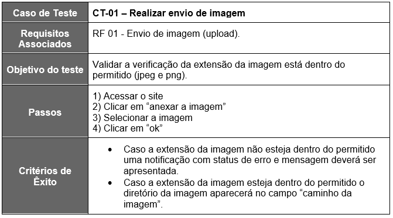
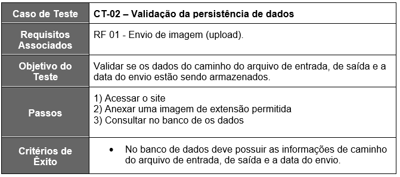
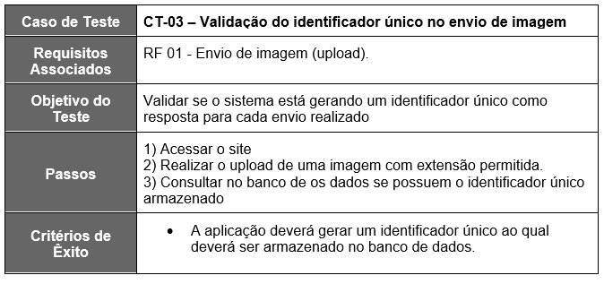
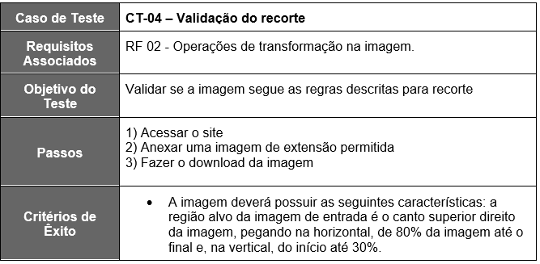
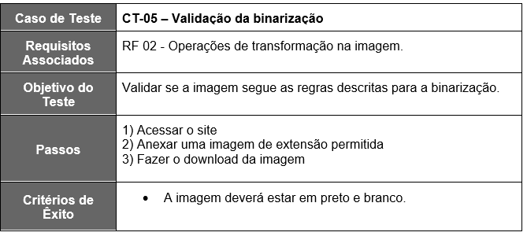
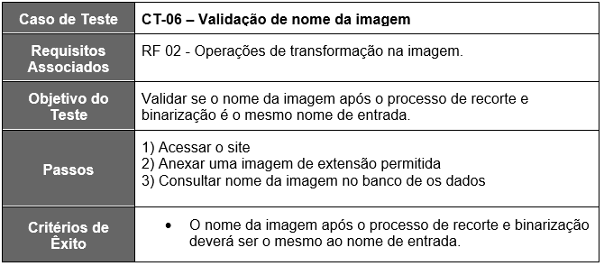
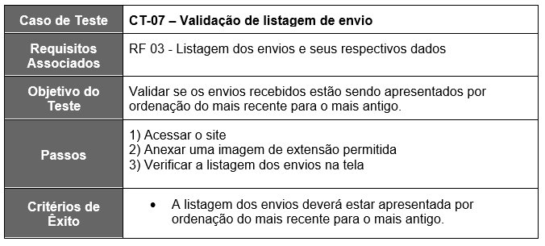
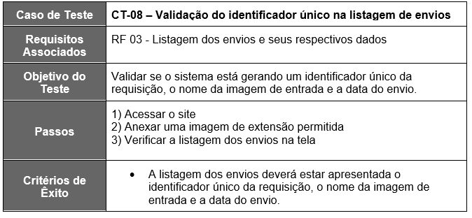
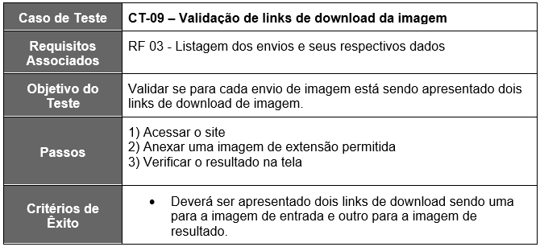
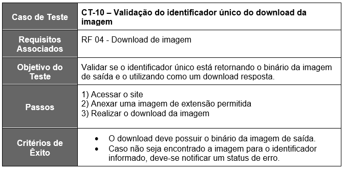

# Plano de Testes de Software
Requisitos para realização dos testes de software são:

●	Site publicado na Internet
●	Navegador da Internet – Chrome e Edge

Os testes funcionais a serem realizados no aplicativo são descritos a seguir.

